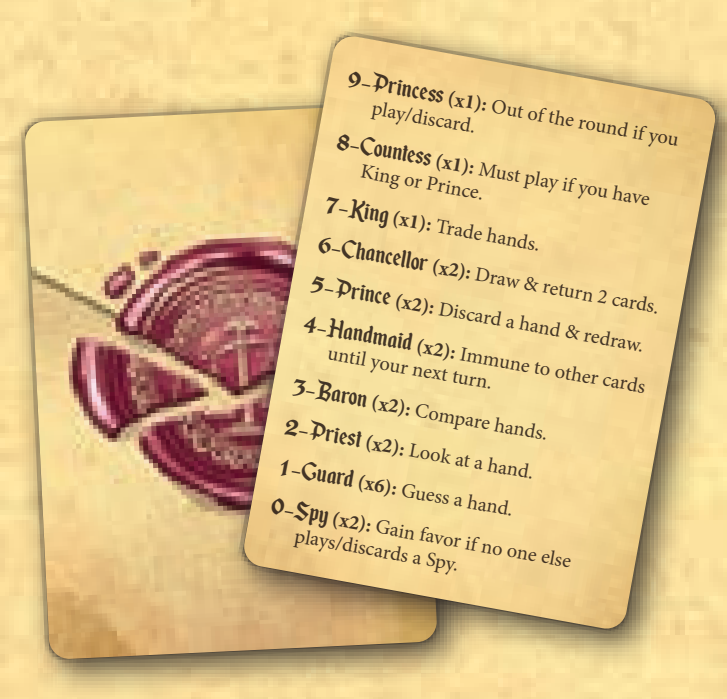

[return](../master.md)
# Love Letter
> Reference: [Z-Man Games post](https://cdn.svc.asmodee.net/production-zman/uploads/2026/04/LL_Rulebook_with_Bag.pdf)
> A unique 2-6 player game with very quick rounds that involves eliminating your opponents when everyone holds only one card in their hand.
## Quick Reference

Reference: Love Letter official reference card. Picture from: [Z-Man Games post](https://cdn.svc.asmodee.net/production-zman/uploads/2026/04/LL_Rulebook_with_Bag.pdf)

## Table of Contents
- [Setup](#setup)
- [Objective](#objective)
- [Rules](#rules)
- [Scoring](#scoring)
- [Additional Notes](#additional-notes)
## Setup {#setup}
When using a regular deck of cards, here is what to include:
- 1x 9 (Princess), 8 (Countess), 7 (King)
- 2x 6 (Chancellor), 5 (Prince), 4 (Handmaid), 3 (Baron), 2 (Priest), Joker (Spy)
- 5x Face Cards (Guard) (any combination of K, Q, J will do)

Setup for each round:
- Shuffle the deck and deal one card to each player
- The player who won the last round takes the first turn

## Objective {#objective}
how you win/lose

## Rules {#rules}

### First Turn {#first-turn}

### Every Turn {#every-turn}

## Scoring {#scoring}

### Additional Notes {#additional-notes}