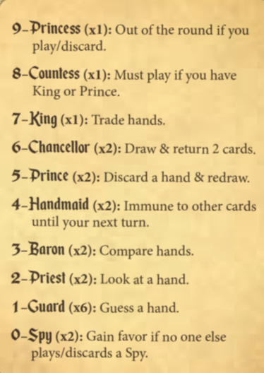

[return](../master.md)
# Love Letter
> Reference: [Z-Man Games post](https://cdn.svc.asmodee.net/production-zman/uploads/2026/04/LL_Rulebook_with_Bag.pdf)
> A unique 2-6 player game with very quick rounds that involves eliminating your opponents when everyone holds only one card in their hand.
> Recommended players: 4
## Quick Reference

Reference: Love Letter official reference card. Picture from: [Z-Man Games post](https://cdn.svc.asmodee.net/production-zman/uploads/2026/04/LL_Rulebook_with_Bag.pdf)

## Table of Contents
- [Setup](#setup)
- [Objective](#objective)
- [Rules](#rules)
- [Card Effects](#card-effects)
- [Winning A Round](#winning-a-round)
- [Additional Notes](#additional-notes)
## Setup
When using a regular deck of cards, here is what to include:
- 1x 9 (Princess), 8 (Countess), 7 (King)
- 2x 6 (Chancellor), 5 (Prince), 4 (Handmaid), 3 (Baron), 2 (Priest), Joker (Spy)
- 6x Face Cards (Guard) (any combination of K, Q, J will do)

For Classic Love Letter, remove all Chancellors and Spies, and remove 1 Guard card.

Setup for each round:
- Deal one card to each player
- Remove one card at random from the draw deck and do not show it
- The player who won the last round takes the first turn

## Objective
The first player to reach the target number of points ("favors") across a number of rounds wins the game. 
<b>2 players:</b> 6 points
<b>3 players:</b> 5 points
<b>4 players:</b> 4 points
<b>5-6 players:</b> 3 points

## Rules
### On Your Turn
- Draw a card from the deck
- Choose one card from your hand to discard
- Card effects take place immediately after playing the card
### Card Effects
| Card | Value | Effect |
| --- | --- | --- |
| Princess | 9 | If this card is discarded in any way, you are out of the round |
| Countess | 8 | On your turn, this card must be discarded if the King or Prince is the other card in your hand |
| King | 7 | Swap hands with any other player. If there are no players to target, this effect does not trigger |
| Chancellor | 6 | Draw 2 cards. Choose 2 cards from your hand, and place them in any order at the bottom of the deck.  If there are not enough cards in the deck, draw as many cards as there are remaining in the deck and replace as many cards as you drew from the deck.|
| Prince | 5 | You must choose a player (including yourself), and they must discard their current card and then redraw another card. If there is no one to target, you discard your own hand. The discarded card's effect does not take effect, unless it is the Princess. If there are no other cards in the deck, the discarding player takes the card that was set aside at the start of the round. |
| Handmaid | 4 | You cannot be targeted until your next turn |
| Baron | 3 | Choose another player to compare hands. The player with the lower number value card in their hand is out of the round. If there is a tie, then no one is out |
| Priest | 2 | Choose a player to view the card in their hand  |
| Guard | 1 | Guess the card in a player's hand. If you guess correctly, they are out of the round |
| Spy | 0 | No effect. At the end of the round, you gain a point if you are the only player <b>still in the round</b> to have played/discarded a Spy card. |
### Winning a Round
A player wins a round if:
- All other players are out, or
- The deck has run out and the player's card has the highest number value out of all remaining players.

If there is a tie, the players who tie gain a point.

### Additional Notes
Clarification on some special interactions:
- If there are no players to target and you play the Prince, you must discard your own card.
- If there are no players to target and you play a King/Baron/Priest/Guard, there will be no effect. 
- A player who gained a point through the Spy card's effect does not count as winning the round.