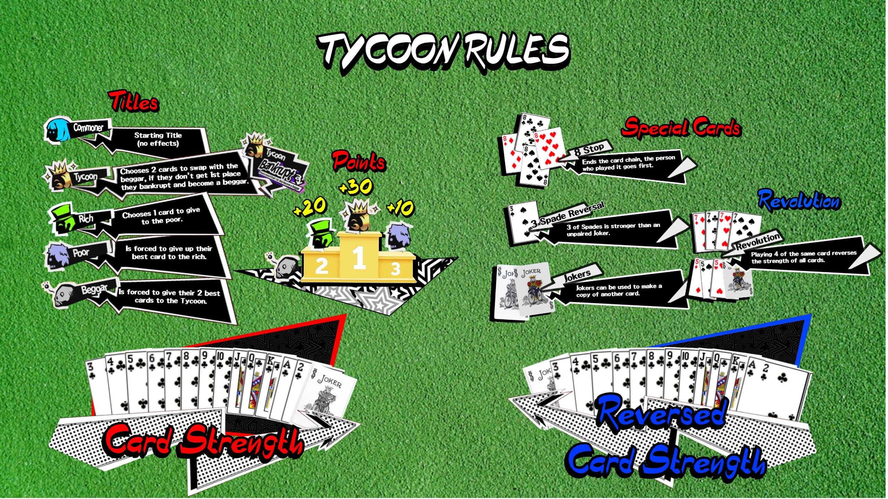

[return](../master.md)
# Tycoon
>Reference: [Gamefaqs forum](https://gamefaqs.gamespot.com/xbox-series-x/370656-persona-5-royal/faqs/81221/basic-rules)
> description of game

## Quick Reference

 Reference: [reddit post](https://www.reddit.com/r/Persona5/comments/gcjgm8/rules_for_tycoon_card_game_in_p5r/) 

## Table of Contents
- [Setup](#setup)
- [Objective](#objective)
- [Rules](#rules)
- [Scoring](#scoring)
- [Additional Notes](#additional-notes)

## Setup
- 52 card deck + 2 Jokers
- Each player gets 13 cards each
    - There will be an extra 2 cards; these can be distributed in any manner the players feel, or they can be excluded from play
- For the first hand, the player with 3:diamonds: starts
    - If the 3:diamonds: is out of play, then the player with the 3:clubs: starts, if that is also out of play, then it goes to the player with the 3:hearts: 
- For the remainder of the hands, the Tycoon begins the hand

## Objective
The player who collects the most points at the end of three hands wins the game.

## Rules
One round is played as a series of "tricks" 
### Player Turn

### Card Combinations
|Combination|Explanation|Example|
|---|---|---|
|Single|||
|Double|||
|Triple|||
|Revolution|||
### Special Cards
|Card|Effect|
|---|---|
|3:spades:||
|Any 8||
|Jokers||
### Revolution
### Ending the Round
### Titles
|Title|Description|
|---|---|
|Commoner||
|Tycoon| Given to the first player to finish shedding all their cards in a round.|
|Rich| |
|Poor| |
|Beggar| |

## Scoring

### Additional Notes

***
As mentioned in the Introduction, Tycoon is a card-shedding game that lasts 3 rounds (or tricks). The main objective is to get rid of one's hand before other opponents in order to win the rank of Tycoon and earn the most points. The game is won by the player with the most points after all 3 rounds have been played. This means you may not necessarily be Tycoon all three rounds, but you can still win as long as you have more points than anyone else.

Everyone starts with the whole deck split evenly among 4 players. The game is played with the full 54-card deck from 2 to Ace, including two Jokers.

Tycoon Ranks
There are four ranks, one assigned to each player, that determine how many points can be won in that round. Everyone starts the game as a Commoner (Heimin), and the order in which the first round ends (who got rid of their hand first, second, and so on) assigns ranks that carry over to the next round. Ranks do not have to stay the same for all three rounds, but there is a clear advantage to maintaining one's Tycoon rank.

Tycoon (Daifugo) = this is the highest rank, and it earns the player 30 points if they get rid of their hand first.
Rich (Fugo) = second-highest rank, earned by the second person to get rid of their cards after Tycoon. Earns 20 points.
Poor (Hinmin) = third-highest rank, wins 10 points.
Beggar (Daihinmin) = lowest rank, does not win any points. NOTE: A Tycoon who does not exit first in the next round automatically becomes a Beggar, leaving the remaining 3 opponents to battle it out for the ranks of Tycoon, Rich, and Poor.
Ranks also determine who trades cards with whom on rounds 2 and 3, and which cards can be traded.

Trading Cards
Trading cards occurs at the start of rounds 2 and 3, after ranks have been established by the outcome of Round 1. Below is the order of trading (exchanging cards), as well as which cards can be traded.

Beggar (must give away two of their highest-ranked cards) ↔ Tycoon (must give away any two cards)
Poor (must give away their highest-ranked card) ↔ Rich (must give away any one card)
Card Rank Order
The rank order of cards in Tycoon is as follows:

Cards 3 to Ace behave in the traditional way (4 is higher than 3, 5 is higher than 4, and so on, until Ace is higher than King)
2s are higher than and beat Ace
Special Cards
In addition to the above behavior, there are special cards as below:

Jokers act as a wild card: they can be used...
...alone (or together with the other Joker) to represent a card (or pair) one rank higher than the one (or pair) currently on the table to beat it
...in combination with one or more regular cards to create a pair, triple, or even quadruple (e.g., two 10s and a Joker can be used as three 10s)
3 of Spades beats Joker
ONLY the 3 of Spades has this power (a 3 of any other suit will not work); if a single Joker is used to beat a lower card, a 3 of Spades will trump it
It cannot beat any other cards, and it cannot be used to beat a Joker pair
8 Stop is an 8 of any suit (or combination of 8s, or 8s and Jokers) and acts like a Skip card (stylized as End Turn or 8 Cut in the game)
If an 8 is used to beat card(s) currently on the table, it ends the turn, makes all opponents skip, and starts the next turn with the player who used it
One 8 card is sufficient to trigger End Turn; however, the number of 8s used must match the number of cards to beat (e.g., if a pair of 5s is on the table, the player must use a pair of 8s, or an 8 + Joker) to end the turn
Playing Cards
Each game is played with 4 players, and 3 opponents are selected at random by AI. If you don't like the selected opponents, simply exit the Tycoon table and interact with it again to shuffle opponents.

Any card can be played at the start. Players have the option to play a pair, triple, or even a quadruple (set of four). The only rule is that one must beat cards currently on the table in the same set fashion -- that is, if a single was played, it can only be beaten by a single card, if a pair was played, it must be beaten with a pair, and so on.

Passing

In addition to beating cards, you always have the option to Pass. Passing is optional if you have a card that can beat card(s) currently on the table, and forced when you have no cards of high enough rank to continue. It can be an asset, so be sure to check our the next section for tips on passing.

Revolution and Counterrevolution
The game also features a special action and a counter-action, called Revolution and Counterrevolution.

Revolution can be triggered by any player throwing four of the same card (e.g., four 7s, or two 7s + two Jokers, etc.). This reverses the rank order of cards, such that lower cards now beat higher cards in the opposite rank-order.

Notes:
Jokers and 3 of Spades still retain their special uses. A 3 of Spades can still beat a Joker, and a Joker can still stand in for another card(s) or make a set with other cards.
An 8 card can still cause End Turn, but note its reversed value.

Counterrevolution can be triggered by another player in same turn beating the set of four cards thrown down by the previous player, by beating it with another set of four cards (NOTE that since Revolution is currently active, the set of four cards must now be 'higher' in rank under the newly reversed rank-order to beat the set that caused a Revolution).
Counterrevolution does not need to occur within the same turn to work; a player can wait until the next round to trigger a Counterrevolution if they cannot beat the current set of four cards in rank.